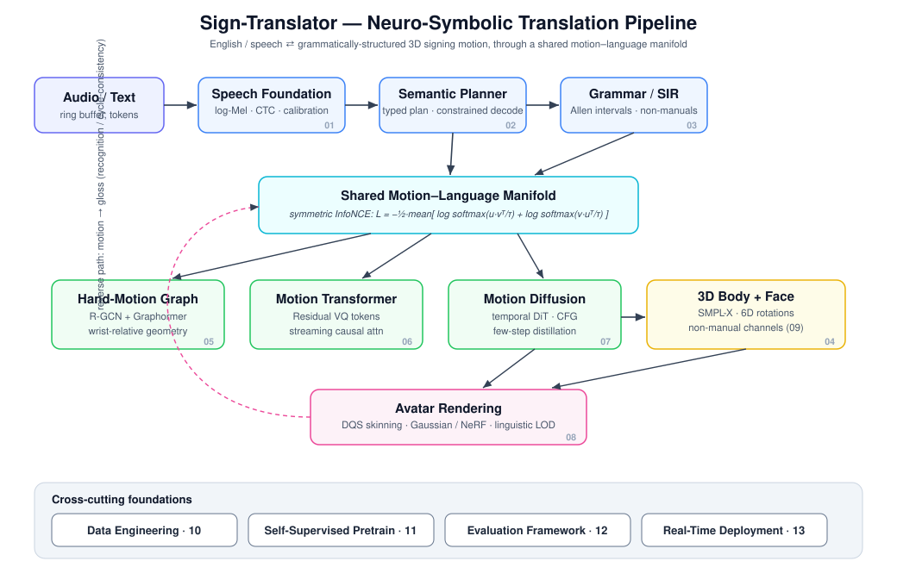
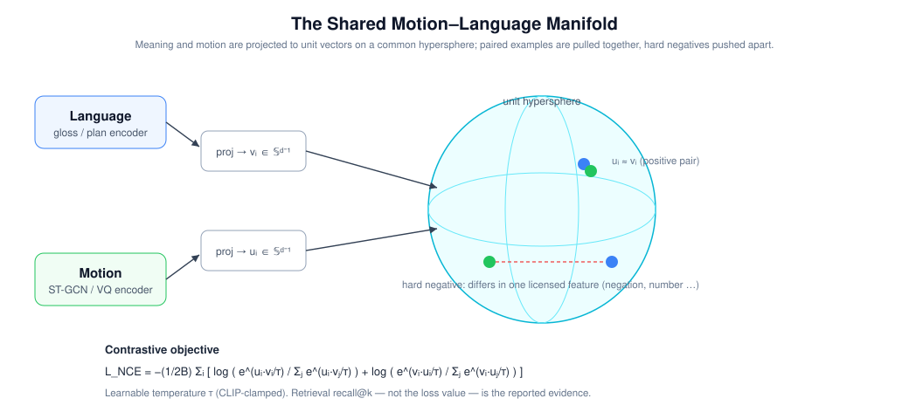
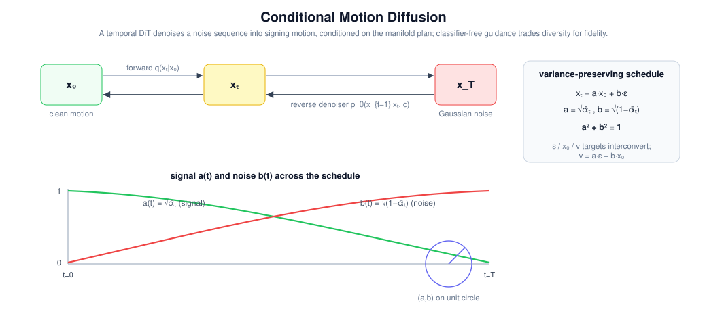
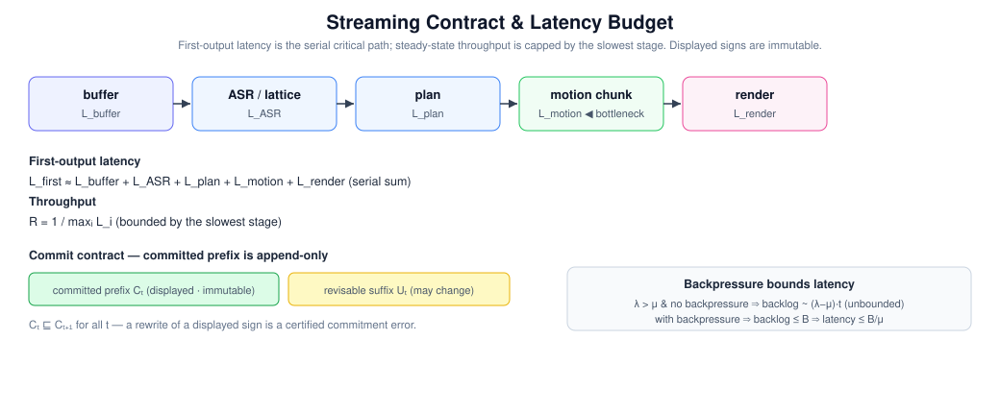

# Sign-Translator

**A neuro-symbolic framework for bidirectional translation between spoken/written language and grammatically-structured three-dimensional sign-language motion.**

Sign-Translator treats sign language not as a sequence of isolated gestures but as a
*continuous, grammatically-organised 3D language*. Spoken or written meaning and 3D
human motion are aligned into a single shared latent manifold; grammatical structure
(negation, questions, topicalisation, spatial reference, non-manual markers) is carried
explicitly as a symbolic intermediate representation; and continuous signing motion is
produced by a conditional diffusion generator that respects both the linguistics and the
biomechanics of the signing body.

The repository implements and unit-tests mathematical primitives for thirteen
research layers in pure PyTorch/NumPy. The active executable path uses only the compact
core under `signtranslator/models/`; most specialized layer packages remain independent
research modules rather than an integrated translator. Each layer is specified in a companion design document under
[`docs/`](docs/) that fixes the mathematics before the code, and every non-trivial
mathematical claim is checked by an adversarial test rather than asserted.



---

## 1. Design thesis

Most sign-language pipelines optimise a single surface metric (BLEU, WER, or a
pose-reconstruction error) end-to-end. Three commitments distinguish this project:

1. **Sign language is a language, not an animation.** Grammar is represented
   *symbolically and temporally* — as a graph of typed events over time intervals —
   so that meaning-changing structure (a head-shake that negates, a brow-raise that
   marks a yes/no question, a spatial locus that binds a referent) is a first-class
   object, not an emergent side-effect of a motion model.

2. **Meaning lives on a shared manifold.** Language and motion are projected to the
   same unit hypersphere, so translation becomes *retrieval and generation in a common
   geometry* rather than opaque sequence-to-sequence transduction. The same manifold
   supports the forward direction (meaning → motion) and the reverse (motion → gloss),
   giving a measurable cycle-consistency signal.

3. **Claims must be falsifiable.** A lower loss is never accepted as evidence of
   linguistic quality. The evaluation layer is a *chain of falsifiable contracts* with
   mandatory caveats, and pervasive tests distinguish genuine mathematical properties
   from floating-point artefacts.

The system is deliberately built as swappable layers behind small interfaces: heavy
foundation models (Whisper/wav2vec2-style ASR, an LLM planner, licensed body/hand/face
bases such as SMPL-X and FLAME) sit behind contracts, so a controllable synthetic
stand-in can be replaced by a production model without touching the surrounding
mathematics.

---

## 2. The thirteen-layer stack

Each layer has a design/math document in [`docs/`](docs/) and a Python package under
[`signtranslator/`](signtranslator/).

| # | Layer | Package | Key techniques and mathematics |
|---|---|---|---|
| 01 | **Speech foundation** | `speech/` | STFT + HTK/Slaney/Whisper log-Mel front-end; YIN pitch; streaming chunker with an exact algorithmic-latency model; CTC prefix-beam search; Viterbi forced alignment; confidence **calibration** (Brier, ECE, temperature scaling); a monotone **fail-closed** policy `PAUSE < FINGERSPELL < EMIT`. |
| 02 | **Semantic planner** | `planning/` | Typed sign-plan schema with an exact serialize/deserialize round-trip; a DFA over the serialization grammar for **constrained decoding** (provably terminating); versioned, content-hashed lexicon retrieval with hallucination detection; sequence-level DPO. |
| 03 | **Grammar / SIR** | `grammar/` | A **Sign Intermediate Representation**: a temporal graph of typed events with **Allen interval-algebra** relations and differentiable hinge losses; relation-biased graph attention; multi-label non-manual scopes; SignBLEU + Cohen's/Fleiss' κ. |
| 04 | **3D human representation** | `pose/` | SMPL-X forward kinematics via **linear blend skinning**; continuous **6D rotation** parameterisation (Gram–Schmidt); the **geodesic** rotation metric; robust re-projection (Geman–McClure); identity/motion disentanglement with a leakage probe. |
| 05 | **Hand-motion graph** | `hand_graph/` | A heterogeneous temporal graph over body/hand/face; relational **R-GCN + graph attention** with basis decomposition; translation- and rotation-invariant **wrist-relative geometry**; a monotone contact field; Graphormer structural encodings. |
| 06 | **Motion transformer** | `motion_transformer/` | **Residual VQ** motion tokenisation (SoundStream-style cascade, single straight-through estimator); a spectral anti-oversmoothing loss (Parseval-exact); streaming causal attention with geodesic **SLERP** chunk-blending. |
| 07 | **Motion diffusion** | `diffusion_gen/` | A temporal **DiT** denoiser (adaLN-Zero); the ε/x₀/**v** parameterisation triangle on a variance-preserving schedule; **classifier-free guidance**; RePaint-style inpainting; consistency / rectified-flow **few-step distillation**. |
| 08 | **Avatar rendering** | `avatar_render/` | **Dual-quaternion skinning** (volume-preserving vs. LBS candy-wrapper collapse); 3D Gaussian-splat and NeRF volume-rendering math (proved to reduce to the same α-compositing operator); handedness-certified retargeting via Kabsch; linguistically-aware level-of-detail. |
| 09 | **Facial / non-manual** | `facial_nmm/` | Concurrent grammatical channels as scoped intervals; a scope-nesting algebra; independent per-channel Bernoulli decoding; certified linguistic ⟂ affect disentanglement; intensity-monotone articulation to FLAME/SMPL-X expression coefficients. |
| 10 | **Data engineering** | `data_engineering/` | Canonical sample schema; a license/consent gate *before* download; a Merkle-style **provenance chain**; multi-view **DLT triangulation** with confidence propagation; leakage-certified grouped split; a sensitive-trait non-inference guard; datasheets. |
| 11 | **Self-supervised pretraining** | `pretraining/` | Masked motion modelling (MAE asymmetry) with an **interpolation-defeating mask certificate**; symmetric InfoNCE with **linguistically-grounded hard negatives** and a shortcut-learning falsification; a loss-vs-usefulness dissociation harness. |
| 12 | **Evaluation framework** | `eval_framework/` | A **chain of falsifiable contracts** across seven caveat-bound metric layers; exact paired permutation / sign tests + bootstrap CIs; a pre-registration + test-set firewall; reproducible **SacreBLEU** and **BERTScore**; blinded comprehension scoring. |
| 13 | **Real-time deployment** | `deployment/` | A display-commit **monotonicity** contract; the latency-budget algebra; a **backpressure bounded-latency theorem**; provable **quantization** error bounds (FP16/INT8); a numerically-certified optimization gate with exact **online-softmax** (FlashAttention) equivalence. |

The intended forward path is *audio/text → speech → plan → SIR → manifold →
hand-graph + transformer + diffusion → 3D body/face → rendered avatar*. That full
path is not currently wired. The active synthetic path is acoustic feature → compact
CTC → gloss planner → 27-joint Cartesian diffusion, with an ST-GCN reverse branch.

---

## 3. Key mathematical concepts

### 3.1 The shared motion–language manifold

Language embeddings `vᵢ` and motion embeddings `uᵢ` are projected to unit vectors on a
common hypersphere and aligned with a **symmetric InfoNCE** objective with a learnable,
CLIP-clamped temperature `τ`:

```
L_NCE = −(1/2B) Σᵢ [ log( e^(uᵢ·vᵢ/τ) / Σⱼ e^(uᵢ·vⱼ/τ) )  +  log( e^(vᵢ·uᵢ/τ) / Σⱼ e^(vᵢ·uⱼ/τ) ) ]
```



The subtlety the project insists on: *random* negatives let a model "solve" the task
with a shortcut (signer identity, clip length, background), which looks like a low loss
but encodes no linguistics. Layer 11 therefore mines **hard negatives** that differ from
the positive in exactly one *licensed grammatical feature* (negation, question type,
entity, aspect, number, role-shift) using a controllable grammar oracle, and proves — as
a theorem on constructed embeddings — that a signer/length shortcut drives the
random-negative loss to ≈ 0 yet fails on hard negatives, while a genuine content
representation succeeds on both. Evidence is reported as retrieval recall@k and linear
probes for handshape / non-manual markers, never as the loss value.

### 3.2 Rotations, geodesics, and the body model

3D pose is expressed in the **continuous 6D rotation** representation (the first two
columns of a rotation matrix, re-orthonormalised by Gram–Schmidt), which avoids the
discontinuities of quaternions and Euler angles at the antipode. Rotational error uses
the **geodesic distance on SO(3)**, exactly the metric the evaluation document mandates:

```
d_geo(R, R̂) = arccos( (tr(Rᵀ R̂) − 1) / 2 ).
```

The body is posed by SMPL-X **linear blend skinning** `M(θ,β) = LBS(T̄ + Bₛ + Bₑ + Bₚ, J, θ, W)`
along a kinematic tree; a proven invariant is that global rigid motion is exactly
equivariant *only because* the skinning weights form a partition of unity and the pose
correctives exclude the root joint. Two recurring failure modes are caught and
distinguished from real error: `arccos` near ±1 has an amplified `sqrt` sensitivity
(identity rotations register ~3e-8 geodesic error in float32), and a `look_at` camera
built from the wrong cross-product order silently produces a *reflection* (det = −1)
rather than a rotation.

### 3.3 Grammar as a temporal interval algebra

The Sign Intermediate Representation is a graph `G = (V, E)` whose nodes are typed events
(manual signs, classifiers, fingerspelling, non-manual markers) carrying `[t_start,
t_end]` intervals, and whose edges are **Allen relations** (precedence, overlap, scope
containment, coreference, spatial locus). Each relation has a differentiable hinge loss,
so grammatical constraints are trainable — e.g. a non-manual negation *scope* must
temporally *contain* the manual event it negates. A key discovered distinction: the
structural validator checks that a scope edge has a non-manual source and manual target,
but interval *containment* is enforced by the differentiable `scope_containment_loss` —
structure and loss do different jobs and are tested separately.

### 3.4 Motion synthesis: residual quantisation and diffusion

Continuous motion is first tokenised by a **Residual Vector Quantiser** — a cascade
`r_{i+1} = r_i − c_i`, `z_q = Σ c_i` — with a single straight-through estimator over the
whole cascade (a per-stage estimator would detach later stages, a bug the tests pin).
Generation is then a **conditional diffusion** process on a variance-preserving schedule:

```
xₜ = a·x₀ + b·ε ,     a = √ᾱₜ ,  b = √(1−ᾱₜ) ,     a² + b² = 1.
```



The `a² + b² = 1` identity places `(a, b)` on the unit circle and lets the ε-, x₀-, and
**v**-prediction targets interconvert exactly (`v = a·ε − b·x₀`), which the code exploits
and round-trips to 1e-9. A temporal DiT with **adaLN-Zero** initialises every residual
block to the identity (so an untrained model is a well-defined no-op — a property, not a
bug, and the reason multimodality tests use an *activated* denoiser). Classifier-free
guidance `ε̂ = (1+w)·ε_c − w·ε_u` trades sample diversity for fidelity, and few-step
consistency/rectified-flow distillation compresses sampling once a quality baseline is
established.

### 3.5 Non-manual grammar and the body-render boundary

Non-manuals (brow, eye-aperture, gaze, head, torso, cheek, mouth) are modelled as
*concurrent* grammatical channels — independent per-frame Bernoullis, never a softmax,
because two markers can be active at once — with a scope-nesting algebra that proves
concurrent scopes are either disjoint or properly nested. Articulation to expression
coefficients is intensity-*monotone*: a stronger brow-raise yields a strictly larger
coefficient. At the render boundary, appearance and linguistic quality are *structurally*
separated — an `AppearanceReport` cannot express a signing verdict (it raises), so PSNR
or SSIM can never be mistaken for grammatical correctness.

### 3.6 Evaluation as falsifiable contracts

The evaluation layer encodes the principle that *no single metric can certify a signed
message*. A `Contract` passes only if its metric meets a threshold in the required
direction **and** carries its mandatory caveat; a chain is *adequate* only if every
contract passes (a monotone conjunction), so an excellent speech score cannot mask a
failing non-manual layer. Statistics are exact and self-contained: a paired sign-flip
**permutation test** and an exact binomial **sign test** both reproduce a hand-computed
p = 0.25 on `d = [1,2,3]`. A consequence made explicit: three random seeds can never
reach p ≤ 0.05 by these tests (the p-value floor is `2/2³`), so the paired test runs over
the many held-out test items while the seeds supply the confidence interval. Reproducible
**SacreBLEU** (with a settings signature) and **BERTScore** (greedy P/R/F1, exact only in
float64) are provided but always caveated as no substitute for signer evaluation.

### 3.7 Real-time deployment

The streaming contract holds a committed prefix `Cₜ`, a revisable suffix `Uₜ`, and avatar
state `qₜ`; only `Uₜ` may change. **Display-commit monotonicity** makes "already-displayed
signs cannot be silently changed" a checkable invariant: `Cₜ ⊑ Cₜ₊₁` for all `t`, and a
rewrite is a certified commitment error.



The latency algebra separates *throughput* (`1/maxᵢ Lᵢ`, capped by the slowest stage) from
*first-output latency* (the serial sum `L_buffer + L_ASR + L_plan + L_motion + L_render`),
and rejects any "<200 ms" claim that fails to disclose chunk size, lookahead, reordering,
and quality loss. **Backpressure** is a bounded-latency *theorem*: with `λ > μ` and no
backpressure the backlog grows as `(λ−μ)·t` without bound, whereas throttling the source
keeps occupancy `≤ B` and hence latency `≤ B/μ`. Every optimisation must pass a numerical
**equivalence** gate against eager execution *and* a quality non-regression contract:
symmetric INT8 has a proven per-element error `≤ scale/2`, FP16 a relative error `≤ 2⁻¹¹`,
and a FlashAttention-style **online softmax** is shown to equal full attention exactly
(to 1e-12 in float64), so a fast kernel is *certified* rather than assumed.

---

## 4. Repository layout

```
signtranslator/
  speech/            01  audio front-end, CTC, calibration, fail-closed policy
  planning/          02  typed sign-plan, constrained decoding, lexicon retrieval
  grammar/           03  SIR graph, Allen algebra, SignBLEU, non-manual scopes
  pose/              04  SMPL-X, 6D rotations, geodesics, robust reprojection
  hand_graph/        05  heterogeneous graph, R-GCN + Graphormer, wrist geometry
  motion_transformer/06  residual VQ, spectral loss, streaming attention + SLERP
  diffusion_gen/     07  temporal DiT, CFG, inpainting, consistency distillation
  avatar_render/     08  DQS skinning, Gaussian/NeRF math, LOD, appearance guard
  facial_nmm/        09  concurrent non-manual channels, disentanglement, FLAME map
  data_engineering/  10  schema, provenance, triangulation, splits, datasheets
  pretraining/       11  masked modelling, hard negatives, evidence battery
  eval_framework/    12  contract chain, statistics, SacreBLEU/BERTScore, model card
  deployment/        13  streaming contract, latency, quantization, optimization gate
  models/ data/ training/ analysis/ eval/     shared core (manifold, trainer, CLI)
docs/                design + mathematics documents, one per layer  (+ figures/)
tests/               adversarial unit tests, one suite per stage
```

Roughly 20k lines of implementation across ~150 modules, with a companion mathematics
document for every layer.

---

## 5. Utilisation

The layers are ordinary Python modules and compose directly. A few representative entry
points:

```python
# Shared manifold: align language and motion embeddings, then retrieve.
from signtranslator.models.alignment import info_nce_loss, ContrastiveAligner

# 3D rotations and the geodesic metric (Doc 04).
from signtranslator.pose.rotations import rotation_6d_to_matrix, geodesic_distance

# Grammar: build a Sign Intermediate Representation and score temporal constraints.
from signtranslator.grammar.sir import SIRGraph
from signtranslator.grammar.temporal import precedence_loss

# Generation: conditional motion diffusion with classifier-free guidance (Doc 07).
from signtranslator.diffusion_gen.generator import DiffusionMotionGenerator

# Evaluation: a falsifiable-contract chain over the metric stack (Doc 12).
from signtranslator.eval_framework import EvaluationChain, Contract, Direction

# Deployment: certify an optimisation is numerically equivalent + quality-preserving.
from signtranslator.deployment import certify_optimization, online_softmax_attention
```

An end-to-end synthetic pipeline (ingest → train → analyse) is driven by
[`signtranslator/run.py`](signtranslator/run.py); the shared architecture and the core
mathematics are documented in [`docs/ARCHITECTURE.md`](docs/ARCHITECTURE.md) and
[`docs/MATH.md`](docs/MATH.md).

```bash
python3.12 -m venv .venv
.venv/bin/python -m pip install -r requirements.lock
.venv/bin/python -m pip install --no-deps -e .
.venv/bin/python -m signtranslator.run --generate-synthetic --corpus-dir ./corpus
.venv/bin/python -W error -m pytest
```

The CPU-only PyTorch constraint is documented in the design notes; the synthetic corpora
correlate spoken ↔ gloss ↔ motion through a fixed vocabulary cipher so that every property
can be checked deterministically without licensed data.

---

## 6. Verification philosophy

Rather than reporting benchmark leaderboard numbers (which would require licensed corpora
and trained foundation models the repository deliberately stubs), correctness is
established by *adversarial mathematical tests*: exact identities in float64, invariance
and equivariance checks, gradient-flow assertions, minimal-pair oracles, and explicit
separation of floating-point artefacts from genuine errors. Each layer is verified twice
consecutively under `-W error::UserWarning`, and the whole project is kept green as a
regression suite. The design documents' *Findings* sections record every real defect that
was found and fixed and every subtlety discovered — for example, that a per-stage
straight-through estimator silently detaches residual-VQ stages, or that a three-seed
permutation test is mathematically incapable of significance at α = 0.05.

---

## 7. Scope and honesty

This is a rigorously-implemented **research core**, not a deployed product. No real
signing corpora, human raters, licensed body/face bases, or GPU inference engines are
included: those are gated, licensed, or hardware-bound, and each sits behind a small
interface so a production component drops in behind the same contract and the same
numerical gate. Human-panel instruments (comprehension, reliability) are *specified and
scaffolded*, not performed. Every claim that would require real training or hardware is
implemented as a harness and labelled as such. What *is* here is a broad set of
independently tested mathematical components plus a smaller integrated synthetic core.
Synthetic tests establish numerical and mechanical properties, not real linguistic
validity or human comprehension.

---

## 8. Primary references

The design documents cite their sources in full; the load-bearing ones include:
CLIP and InfoNCE (contrastive alignment); SMPL-X and the 6D rotation representation
(3D body); Allen's interval algebra (grammar); VideoMAE / Masked Autoencoders and
wav2vec 2.0 (pretraining); DDPM/DDIM, DiT, classifier-free guidance, and consistency
models (diffusion); 3D Gaussian Splatting and NeRF (rendering); SignBLEU, SacreBLEU,
BERTScore, Datasheets, and Model Cards (data and evaluation); FlashAttention-2, ONNX
Runtime, TensorRT, and CUDA Graphs (deployment).

*See [`docs/`](docs/) for the per-layer design-and-mathematics documents, each ending in a
post-implementation Findings section.*
