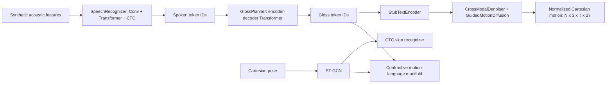

# 02 — Current Architecture and Integration Map

## 1. Why an integration map is necessary

The repository has two overlapping architectural levels:

1. a compact executable model under `signtranslator/models/`;
2. specialized packages corresponding to the thirteen research layers.

The compact model is the path used by `signtranslator/run.py`. Most specialized
packages are independently testable but are not called by that path. This
distinction determines what can currently be trained.

## 2. Active executable path



### Active components

| Function | Active implementation | Training signal |
|---|---|---|
| Acoustic recognition | `models/speech.py` | CTC |
| Spoken-token to gloss | `models/planner.py` | Teacher-forced cross-entropy |
| Sign recognition | `models/recognition.py` + ST-GCN | CTC |
| Motion-language alignment | `models/alignment.py` | Symmetric InfoNCE |
| Motion generation | `models/guided_diffusion.py` | Coordinate and velocity loss |
| Training orchestration | `training/trainer.py` | Weighted sum of branch losses |
| Evaluation | `analysis/report.py` | Synthetic branch metrics |

## 3. Specialized packages not integrated into the active path

| Research layer | Package | Implemented examples | Active in `run.py`? |
|---|---|---|---|
| Speech foundation | `speech/` | Features, calibration, revision, LoRA, policy | No |
| Semantic planning | `planning/` | Typed plans, automaton, constrained decoding | No |
| Grammar/SIR | `grammar/` | Event graph, interval losses, non-manual scope | No |
| Human representation | `pose/` | 6D rotations, toy body model, fitting | No |
| Hand graph | `hand_graph/` | Heterogeneous relations and geometry | No |
| Motion Transformer | `motion_transformer/` | RVQ, VQ-VAE, duration, streaming | No |
| DiT diffusion | `diffusion_gen/` | DiT, v-prediction, projection, inpainting | No |
| Avatar rendering | `avatar_render/` | Skinning and per-ray/per-pixel primitives | No |
| Facial/non-manual | `facial_nmm/` | Concurrent channels and scope losses | No |
| Data engineering | `data_engineering/` | Schema, consent, provenance, grouping | No |
| Pretraining | `pretraining/` | Masked modeling and hard negatives | No |
| Evaluation framework | `eval_framework/` | Contracts, statistics, protocols | No |
| Deployment | `deployment/` | Latency and runtime-control primitives | No |

Some specialized packages import mathematical helpers from one another, but
this is not equivalent to participation in the train/inference graph.

## 4. Representation mismatch

The active generator predicts Cartesian keypoints with shape `(N, 3, T, 27)`.
The richer research packages assume representations such as:

- per-joint 6D rotations;
- SMPL-X-style pose, shape, translation, and expression parameters;
- dense hand graphs;
- facial blendshape or non-manual channels;
- discrete residual-VQ motion codes;
- explicit sign plans and temporal event graphs.

No implemented adapter currently turns the active diffusion output into the full
parameter stream required by the rendering and facial packages. Conversely, the
advanced motion chain is not used as the active diffusion target.

## 5. Duplicated concepts

The repository currently has parallel implementations of several ideas:

- `models/planner.py` versus `planning/`;
- `models/diffusion.py` and `models/guided_diffusion.py` versus `diffusion_gen/`;
- `models/speech.py` versus `speech/`;
- the Cartesian ST-GCN path versus rotation-based `pose/` and
  `motion_transformer/`;
- `analysis/report.py` versus `eval_framework/`.

Duplication increases the chance that one implementation is fixed while the
other remains stale. The team should designate:

- one canonical data contract;
- one canonical semantic representation;
- one canonical motion representation;
- one canonical generator;
- one canonical evaluation entry point.

## 6. Interfaces that must be added

### Data-to-model bridge

```text
governed Sample records
    -> decoded media
    -> synchronized features and annotations
    -> fitted/triangulated motion plus confidence
    -> grouped split
    -> versioned training shards
    -> masked batches
```

### Semantics-to-motion bridge

```text
source language
    -> typed plan
    -> validated SIR
    -> duration/spatial/non-manual conditioning
    -> rotation/body/face motion
```

### Motion-to-render bridge

```text
generated rotations/translation/expression
    -> body model
    -> retargeted rig
    -> frame renderer
    -> timestamped video/stream
```

### Model-to-runtime bridge

```text
complete checkpoint bundle
    -> deterministic loader
    -> raw input preprocessing
    -> inference and abstention
    -> rendering
    -> latency and quality telemetry
```

## 7. Architectural recommendation

Do not attempt to connect all thirteen packages simultaneously. Establish one
vertical slice first:

1. validated text/gloss input;
2. minimal typed sign plan;
3. rotation-based body and hand motion;
4. deterministic avatar rendering;
5. signer-reviewed evaluation.

Add raw speech, streaming revision, advanced pretraining, and photorealistic
rendering only after this slice is reproducible and understandable.

