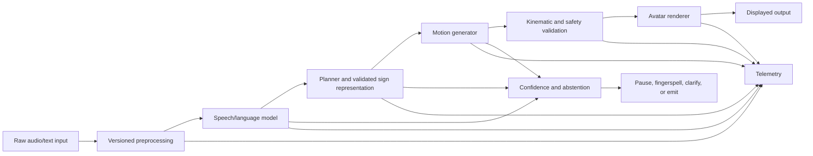

# 07 — Training, Evaluation, and Deployment Gates

## 1. Training is not one event

A credible training program consists of separate experiments with different
questions. The team should not begin with a single end-to-end loss and assume
that every branch will learn useful behavior.

## 2. Experiment hierarchy

### Level 0 — Numerical smoke test

Purpose:

- detect shape, device, gradient, and serialization failures.

Required checks:

- forward and backward pass;
- finite loss and gradients;
- parameters change after an optimizer step;
- checkpoint save and reload;
- identical inference before and after reload;
- CPU and target accelerator compatibility.

This level may use synthetic data. Passing it says nothing about language
quality.

### Level 1 — Tiny-subset overfit

Purpose:

- prove that the representation and loss can fit real examples.

Protocol:

- use a small, visually inspected subset;
- disable most augmentation;
- train each branch independently;
- confirm near-perfect training fit;
- inspect generated motion and intermediate plans.

Failure indicates a model, representation, target, masking, or optimization
problem. More data will not fix it.

### Level 2 — Controlled held-out generalization

Purpose:

- test whether the model learns content instead of sample identity.

Required splits:

- unseen source recording;
- unseen signer;
- paraphrased source language where available;
- controlled minimal semantic pairs.

### Level 3 — Full research experiment

Purpose:

- compare architecture choices and baselines.

Requirements:

- pre-declared primary endpoint;
- locked test set;
- multiple independent training runs;
- confidence intervals;
- ablations;
- error slices;
- complete artifact and configuration retention.

### Level 4 — Human evaluation

Purpose:

- test whether generated signing communicates correctly and acceptably.

This is required before any claim of usable translation.

## 3. Recommended training phases

| Phase | Trainable modules | Frozen modules | Primary metric |
|---|---|---|---|
| Motion reconstruction | motion tokenizer/body decoder | language stack | held-out reconstruction and hand fidelity |
| Recognition | motion encoder + CTC head | generator | signer-held-out sign error |
| Semantic planning | planner/SIR predictor | motion stack | proposition and structure accuracy |
| Conditional generation | generator + conditioning adapter | validated recognizer where appropriate | independent semantic and motion metrics |
| Non-manual generation | facial/NMM heads | stable manual generator initially | scope and comprehension |
| Cross-modal alignment | projection heads, selected encoders | task-dependent | meaning-level retrieval |
| Joint polishing | carefully selected modules | high-risk foundations initially | no regression across all gates |

## 4. Optimization controls

The production trainer should include:

- explicit precision policy;
- gradient accumulation;
- per-module clipping;
- learning-rate schedules stored in checkpoints;
- EMA for generative evaluation;
- deterministic validation seeds;
- per-loss gradient norms;
- dead-branch detection;
- NaN/Inf fail-fast behavior;
- memory and throughput telemetry;
- distributed sampler state where applicable;
- exact batch and sample identifiers in failure logs.

### Loss balancing

Do not select weights solely because aggregate loss decreases. Evaluate:

- scale of each loss;
- gradient norm contributed by each branch;
- cosine similarity between task gradients;
- performance change when each loss is removed;
- whether one easy synthetic objective dominates representation learning.

## 5. Checkpoint contract

A release-quality checkpoint bundle should contain:

```text
artifact/
  model.safetensors or equivalent weights-only file
  model_config.yaml
  training_config.yaml
  tokenizer/
  gloss_vocabulary.json
  sign_plan_schema.json
  skeleton_and_body_model.json
  normalization.npz
  preprocessing_manifest.json
  dataset_manifest.json
  metrics.json
  environment.lock
  source_revision.txt
  model_card.md
```

Training-state checkpoints may additionally contain optimizer, scheduler,
scaler, sampler, epoch, global step, and RNG states. They should be separated
from safe inference artifacts.

## 6. Evaluation matrix

| Layer | Quantitative measures | Required qualitative evidence |
|---|---|---|
| Speech | WER/CER, ECE, Brier, risk-coverage | failure examples under realistic acoustics |
| Planner | proposition F1, slot accuracy, hallucination | plan review by language experts |
| SIR/grammar | relation and scope accuracy | minimal-pair interpretation |
| Recognition | sign/gloss error, sequence accuracy | signer- and phenomenon-level errors |
| Motion | geodesic error, MPJPE, contacts, jerk | synchronized render inspection |
| Hands | handshape/orientation/location | close-up signer review |
| Non-manual | channel and scope F1 | facial/torso interpretability |
| Semantics | independent recognition and retrieval | blinded comprehension |
| Rendering | frame integrity, dropped frames | avatar acceptability |
| Runtime | median/p95/p99 latency and memory | interruption/revision behavior |

## 7. Baselines

At least the following should be considered:

- retrieval of a recorded motion from a lexicon;
- direct text/gloss-to-motion without SIR;
- direct keypoint regression without diffusion;
- diffusion without explicit grammar;
- body-only versus body-plus-hands-plus-face;
- random versus linguistically hard negatives;
- ground-truth motion rendered through the same avatar;
- human-recorded or professionally interpreted upper reference.

An advanced model is not justified unless it outperforms simpler alternatives on
the primary endpoint.

## 8. Human evaluation protocol

### Study design

- recruit qualified participants appropriate to the target language;
- randomize and blind system identity;
- include ground-truth, baseline, and degraded controls;
- evaluate complete propositions, not isolated visual attractiveness;
- record participant language background;
- separate comprehension from naturalness and preference;
- allow “unclear” rather than forcing a guess.

### Primary outcomes

- proposition precision, recall, and F1;
- critical semantic error rate;
- non-manual grammatical interpretation;
- perceived naturalness;
- willingness to use in the declared setting.

### Safety rule

An attractive animation with low comprehension is a failure.

## 9. Deployment architecture

A minimum runtime would require:



## 10. Runtime requirements

- self-contained artifact loading;
- explicit device and precision selection;
- input-size and duration limits;
- authentication and rate limiting for a service;
- privacy-preserving logging;
- raw-audio retention policy;
- confidence-driven pause or clarification;
- committed-prefix streaming semantics;
- measured backpressure behavior;
- model-version telemetry;
- health checks and rollback;
- deterministic replay for incidents;
- content and safety limitations displayed to users.

The current deployment package supplies mathematical utilities and contracts,
not this runtime.

## 11. Deployment release gate

Deployment must remain blocked until all are true:

- a real-data model artifact loads independently;
- raw input reaches rendered output;
- target-hardware latency and memory are measured;
- numerical optimization equivalence is confirmed;
- human comprehension meets the pre-declared threshold;
- critical semantic failures are characterized;
- abstention meaningfully reduces risk;
- privacy and governance requirements are implemented;
- monitoring and rollback are exercised;
- limitations are documented in a model card.

